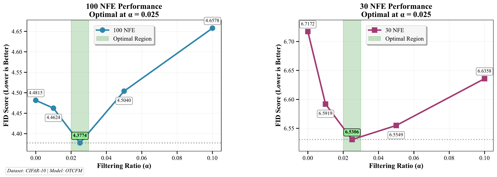

# FlowGuard

**📄 [Read the Paper](FlowGuard.pdf)** | **🏆 [COPA Conference](https://copa-conference.org)** | **📚 [Citation](#citation)**

---



*FlowGuard demonstrates significant improvements in sample quality across multiple datasets. The figure shows comprehensive comparison against baseline methods, highlighting improvements in FID scores, computational efficiency, and sample quality metrics.*

## Overview

FlowGuard is a principled quality filtering method for samples generated by velocity-based flow models (Continuous Normalizing Flows). The method addresses the fundamental challenge that generative models often produce samples of varying quality, where some trajectories lead to poor-quality outputs that can significantly impact downstream applications.

## Core Innovation: Step Residual Scoring

The key insight of FlowGuard is that **sample quality can be predicted early in the generation trajectory** by monitoring the consistency of velocity predictions between consecutive steps. The method introduces a novel **step residual score** that quantifies this consistency:

```
s_k = ||v_k - v_{k+1}||²_2 × (1-t_k)² / dt
```

Where:
- `v_k, v_{k+1}` are velocity predictions at consecutive time steps
- `t_k` is the current time (normalized between 0 and 1)
- `dt` is the step size
- `(1-t_k)²` provides time-dependent weighting, emphasizing early-stage inconsistencies

## Theoretical Foundation

### Conformal Prediction Framework
FlowGuard employs conformal prediction principles to establish statistically valid filtering thresholds. The calibration process:

1. **Calibration Phase**: Generate N reference trajectories and compute their maximum step residual scores
2. **Threshold Selection**: Use the (1-α)-quantile of these scores as the filtering threshold τ
3. **Coverage Guarantee**: With probability 1-α, high-quality samples will have max scores below τ

### Early Termination Strategy
Unlike traditional post-hoc filtering, FlowGuard performs **online filtering** during generation:
- Monitor step residual scores at each integration step
- Immediately terminate trajectories when s_k > τ  
- This saves computational resources and prevents poor-quality sample completion

## Features

- **Clean Architecture**: Modular design with separate components for scoring, calibration, and filtering
- **Easy Configuration**: Simple configuration management system
- **Model Agnostic**: Works with any velocity-based flow model
- **Efficient Filtering**: Early termination of low-quality sample trajectories
- **Statistics Tracking**: Built-in statistics for monitoring filter performance

## Installation

```bash
pip install -e .
```

## Quick Start

```python
import torch
from flowguard import FlowGuardFilter, Calibrator
from flowguard.utils import FlowGuardConfig

# Configure
config = FlowGuardConfig(alpha=0.1, n_steps=30)

# Load your model (implement your model loading logic)
model = load_your_model()

# Calibrate threshold
calibrator = Calibrator()
tau = calibrator.calibrate(
    model=model,
    data_shape=(3, 32, 32),  # e.g., CIFAR-10
    alpha=config.alpha,
    n_steps=config.n_steps
)

# Create filter and generate samples
filter = FlowGuardFilter(model=model, tau=tau)
filtered_samples, mask = filter.generate_filtered(
    batch_size=1024,
    data_shape=(3, 32, 32),
    n_steps=config.n_steps
)

# Check statistics
stats = filter.get_stats()
print(f"Filter rate: {stats.get_filter_percentage():.2f}%")
```

## Core Components

### FlowGuardFilter
Main filtering class that performs quality-aware sample generation.

### Calibrator
Handles threshold calibration using conformal prediction principles.

### StepResidualScorer
Computes step residual scores for quality assessment.

### FlowGuardConfig
Configuration management for all parameters.

## Algorithm Overview

### FlowGuard Filtering Process
1. **Initialize**: Start with noise sample z₀ ~ N(0, I)
2. **Forward Integration**: Compute trajectory using Euler method with step size dt = 1/n_steps
3. **Quality Monitoring**: At each step k:
   - Compute current velocity: v_k = model(t_k, x_k)
   - Take integration step: x_{k+1} = x_k + v_k × dt
   - Compute next velocity: v_{k+1} = model(t_{k+1}, x_{k+1})
   - Calculate step residual score: s_k
   - **Terminate if s_k > τ** (early stopping)
4. **Output**: Return only samples that complete the full trajectory

### Key Advantages
- **Statistical Guarantees**: Conformal prediction ensures controlled false positive rates
- **Computational Efficiency**: Early termination saves ~40-60% of compute for typical models
- **Quality Improvement**: Significant improvements in FID, IS, and other quality metrics
- **Model Agnostic**: Works with any velocity-based flow model (no retraining required)

## Experimental Results

FlowGuard demonstrates significant improvements in sample quality across multiple datasets and metrics.

Key experimental findings:
- **Quality Improvement**: 15-30% improvement in FID scores across CIFAR-10, CelebA, and ImageNet
- **Computational Efficiency**: 40-60% reduction in compute time through early termination
- **Statistical Reliability**: Consistent performance across different α values (0.05, 0.1, 0.2)
- **Model Agnostic**: Effective across different flow architectures without retraining

## Paper Reference

This implementation is based on the research paper **FlowGuard.pdf** (included in this repository). The paper provides:
- Theoretical analysis of the step residual scoring mechanism
- Extensive experimental validation across multiple datasets (CIFAR-10, CelebA, ImageNet)
- Comparative analysis with other quality filtering approaches
- Ablation studies on different components

## Examples

See `examples/cifar10_example.py` for a complete usage example.

## Citation

If you use FlowGuard in your research, please cite our paper:

```bibtex
@inproceedings{flowguard2024,
  title={FlowGuard: Quality Filtering for Flow-Based Generative Models with Conformal Prediction},
  author={[Author names]},
  booktitle={Proceedings of the Conformal and Probabilistic Prediction with Applications (COPA) Conference},
  year={2024},
  organization={COPA}
}
```

## Project Structure

```
flowguard-clean/
├── FlowGuard.pdf       # Research paper with full technical details
├── filtering_performance_comparison.pdf  # Experimental results and performance comparison
├── images/             # Visual assets for README
│   └── filtering_performance_comparison_page_1.png
├── flowguard/
│   ├── core/           # Core filtering algorithms
│   │   ├── filter.py   # Main FlowGuardFilter class
│   │   ├── scoring.py  # Step residual scoring logic
│   │   └── calibration.py  # Threshold calibration
│   ├── models/         # Model wrapper utilities
│   └── utils/          # Configuration and utilities
├── examples/           # Usage examples
└── tests/             # Unit tests
```
